  

<h1 align="center">👋 Hi, I'm Sheikh Sagor</h1>
<h3 align="center">Flutter & Golang Developer | Backend Learner | Competitive Programmer </h3>

---

## 👨‍💻 About Me  
- 🔭 I’m currently working with **Flutter** (Mobile & Web Apps)  
- ⚙️ Learning **Golang Backend Development** (API, REST, Microservices)  
- 🎯 My Goal: Become a strong Backend + Mobile Developer  
- 💬 Ask me about **Flutter, API Integration, Firebase, Go basics**

---

## 🧠 Tech Stack

| Category     | Skills |
|--------------|--------|
| **📱 Frontend / Mobile** |     |
| **⚙️ Backend** |    |
| **🗄️ Database** |   |
| **🚀 Deployment** |    |
| **🛠️ Tools** |    |

---

### Competitive Programming

---

## 🔗 Let's Connect & Collaborate!

| Platform | Details |
|---------|---------|
| **💼 LinkedIn** |  |
| **📧 Email** |  |
| **🌐 Portfolio** | <a href="https://portfolio-eight-snowy-56.vercel.app/"> |

---

## 🐍 Snake Game

---

## 📊 GitHub Stats

---

## ⚡ Activity Graph

---

## 🔥 Streak Stats

## 📊 Metrics

  

---

⭐ **Thanks for visiting my profile!**  
